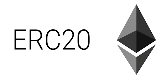

# Developer Coin
This is a EIP20 Ethereum project, this one implements the interface **ERC20**.

   

## Getting Started
These instructions will get you a copy of the project up and running on your local machine.

### Prerequisites
 - node.js
 - npm  
 - truffle 

### Installing
 - **Compile the contract**
 ```bash
    truffle build
 ```
this will create a build folder.


## Built With
 - [Truffle Framework](https://www.trufflesuite.com/docs/truffle/overview)  

## References
 - [Ethereum EIP20](https://github.com/ethereum/EIPs/blob/master/EIPS/eip-20.md)